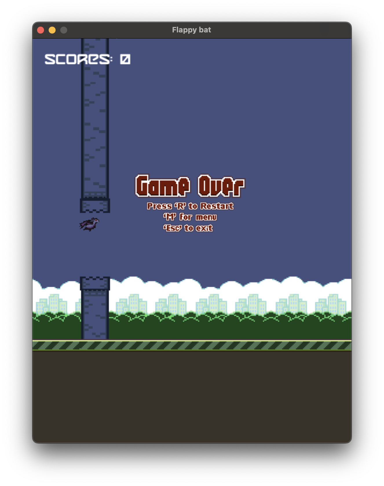
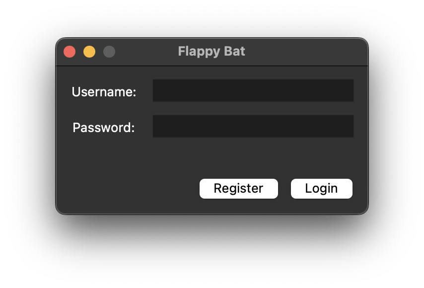
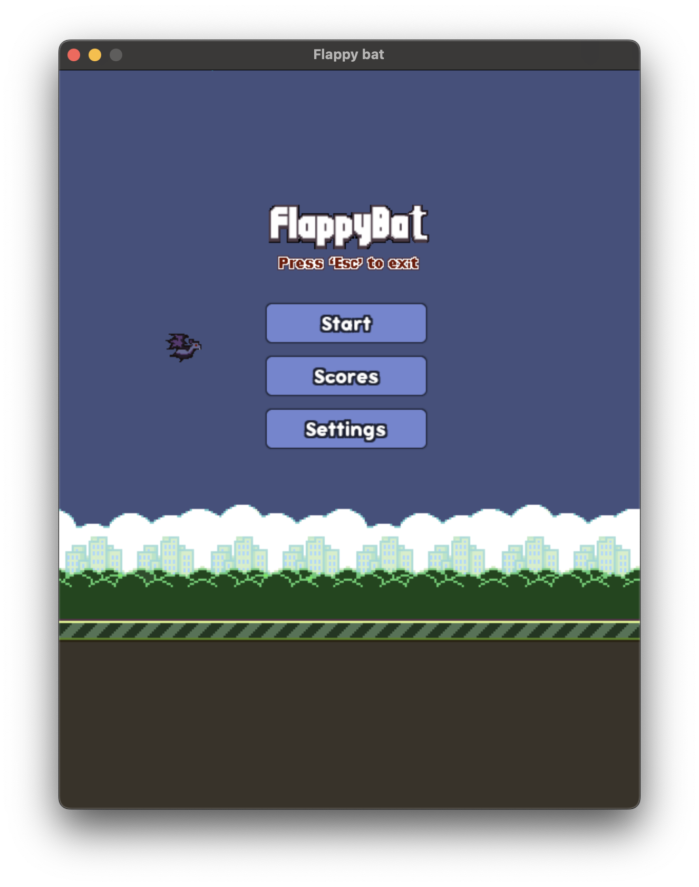
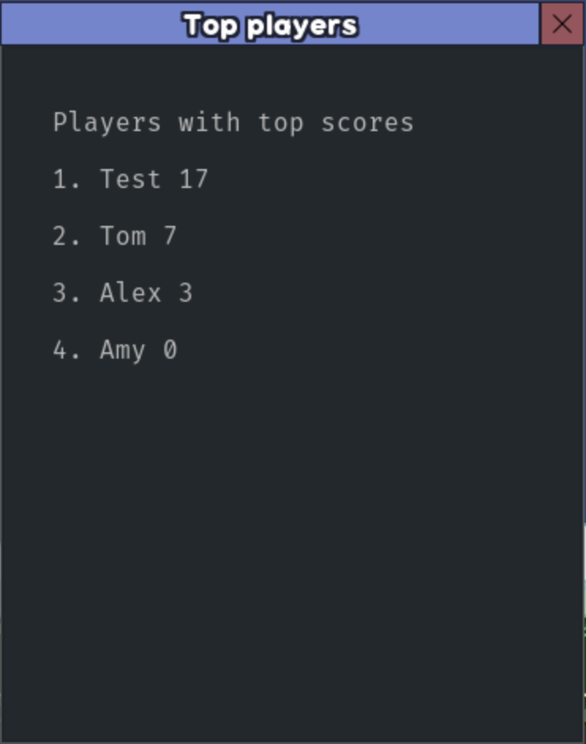
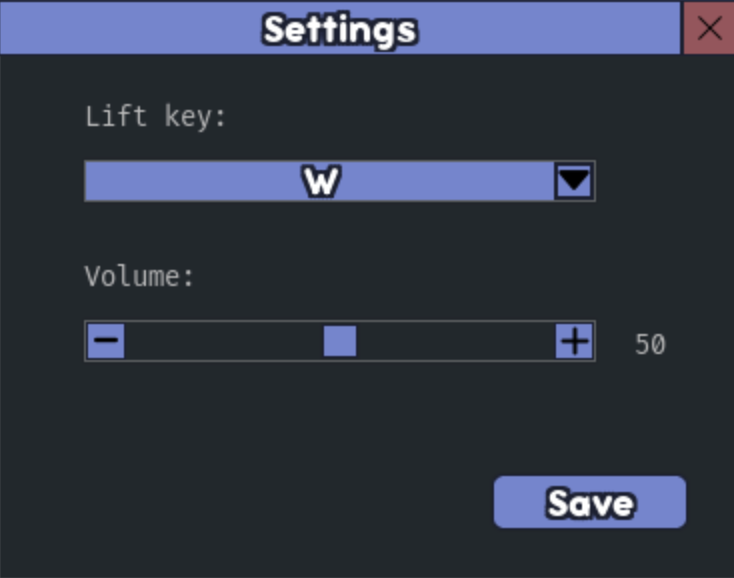

#  Flappy Bat

<p align="center" width="100%">
    
</p>

## Setup 

### Database

To create database do
```bash
cd db
sqlite3 -init schema.sql players.db .quit
```

### Activate Environment

#### Unix

```bash
 source .venv/bin/activate                 
 python3 -m pip install -r requirements.txt
```

#### Windows

TBD

### Deactivate Environment

#### Unix

To close environment
```bash
deactivate
```
To remove environment
```bash
rm -rf venv
```

#### Windows

TBD

#### Notes

Please note that to run application the Python of version 3.11+ is required.

## User Manual

To start a game, the user must login first. If the user does not exist yet, enter the name of the user and password, then press register to create user.



Then the user gets 3 available options:
- Start a game;
- See players scores;
- Adjust settings.



The scores window shows top 20 players with the highest scores.   
The settings window allows the user to adjust sound volume and choose bat lifting key.

&nbsp;
